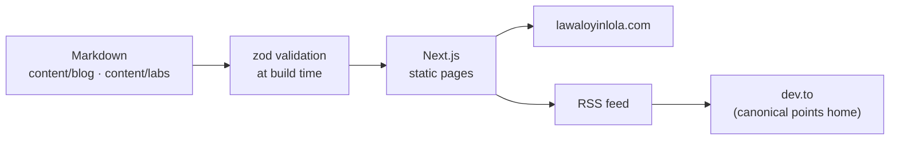
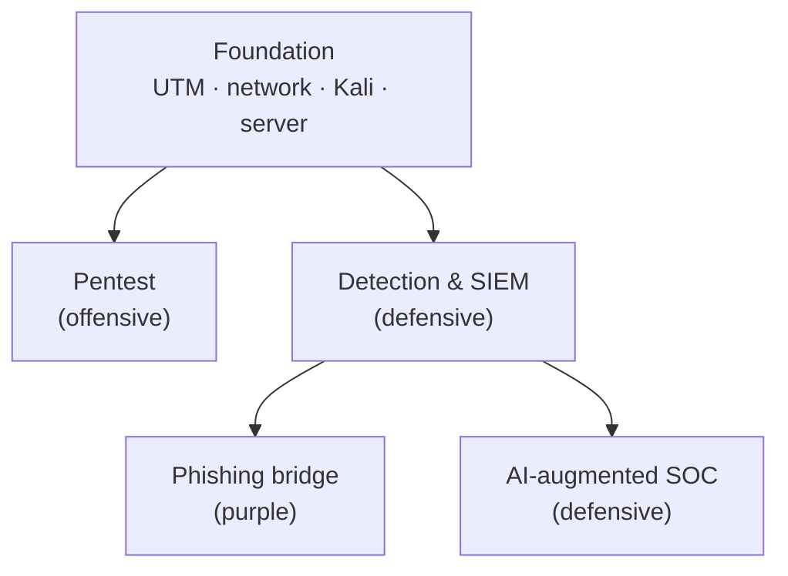

<br />

<div align="center">
  <a href="https://lawaloyinlola.com">
    
  </a>

  <h1 align="center">LAWAL | Portfolio, Blog & Security Labs</h1>

  <p align="center">
    The digital home of Oyinlola Lawal, a frontend engineer learning to break and
    secure the things he builds.
    <br />
    Part showcase, part workbench: high-performance interfaces, a writing habit, and
    hands-on security labs, all in one repo.
    <br />
    <br />
    <a href="https://lawaloyinlola.com"><strong>Explore the live site »</strong></a>
    <br />
    <br />
    <a href="https://github.com/lawalOyinlola">GitHub</a>
    ·
    <a href="https://www.linkedin.com/in/lawaloyinlola">LinkedIn</a>
    ·
    <a href="https://lawaloyinlola.com/security/labs">Security Labs</a>
    ·
    <a href="https://lawaloyinlola.com/blog">Blog</a>
  </p>
</div>

<div align="center">


</div>

---

## 📖 What this is

This is the source for my personal site, and it has grown past "portfolio." It started as a
place to show frontend work, and it still does that: the focus is performance, clean
architecture, and animation that serves usability instead of fighting it. But it is also where
I write about engineering and application security, and where I publish the write-ups from the
security labs I build on my own hardware.

I came to security from the frontend, so the through-line across all of it is the same
instinct: understand how the machine actually works, because that is what shows you both where
it breaks and how to fix it. The site is the showcase; this repo is the workbench.

Three things live here:

- **The portfolio and site:** the pages, sections, and the design system behind them.
- **The blog:** Markdown posts validated at build time and syndicated to dev.to, with the
  canonical URL pointing back here.
- **The security labs:** reproducible lab write-ups under `/security/labs`, each taken end to
  end with the defensive lesson behind every step.

### How content flows through the repo

Posts and labs are plain Markdown. They are validated when the site builds (a bad frontmatter
field fails the build rather than shipping), rendered to static pages, and the blog feed is what
syndicates out to dev.to.



### How the security labs fit together

The labs are a hub-and-spoke set built on one machine: a shared foundation stands the
environment up once, and each track reuses it.



### Key features

- **Next.js 16 App Router:** React Server Components and static generation for fast first loads and good SEO.
- **Markdown content, validated at build:** blog posts and lab write-ups live as plain Markdown, with syntax highlighting, a collapsible table of contents, image zoom, search, and tag filters.
- **Interactive labs hub:** `/security/labs` renders the portfolio as a clickable map where published labs link out and planned ones read as "coming soon."
- **dev.to syndication:** `pnpm sync:devto` pushes posts to dev.to with the canonical URL pointing back here. See [docs/blogging.md](docs/blogging.md).
- **Magnetic micro-interactions & cursor orchestration:** a `Magnetic` component and a `TargetCursor` built on GSAP for a physically reactive UI.
- **GSAP animation:** staggered, scroll-driven sequences engineered for 60fps, with reduced-motion respected.
- **SEO and AI discovery:** Metadata API, JSON-LD structured data, a sitemap, and `/llms.txt` for AI crawlers.
- **Security by default:** a Content Security Policy and security headers on every response, plus CI that fails on high-severity dependency advisories or a committed secret.
- **Accessible, responsive design:** built with WCAG guidelines in mind, fluid from large desktops to mobile with **Tailwind CSS**.

---

## 🛠️ Tech Stack

| Category            | Technology                                                                            | Description                                                          |
| :------------------ | :------------------------------------------------------------------------------------ | :------------------------------------------------------------------- |
| **Framework**       |  Next.js 16     | App Router, Server Components, static generation.                    |
| **Language**        |  TypeScript    | Strict typing for robust, maintainable code.                         |
| **Styling**         |  Tailwind CSS | Tailwind v4, utility-first and responsive.                           |
| **Animation**       |  GSAP           | Complex animation sequences and scroll triggers.                     |
| **Content**         | 📝 unified, remark, rehype, Shiki                                                     | Markdown to HTML with highlighted code; frontmatter validated by zod. |
| **Fonts**           | 🔤 Local Fonts                                                                        | `next/font/local`, optimized for zero layout shift.                  |
| **Package manager** |  pnpm                | Pinned in `package.json` through `packageManager`.                   |
| **Deployment**      |  Vercel            | Edge network deployment, preview deploys per branch.                 |

---

## 🚀 Getting Started

### Prerequisites

- Node.js **20.9 or newer** (Next.js 16's minimum; CI runs Node 22)
- pnpm, which Corepack can provide. On Node.js 25+, Corepack is no longer bundled: run `npm install --global corepack@latest` first, then `corepack enable`.

### Installation

1.  **Clone the repository**

    ```bash
    git clone https://github.com/lawalOyinlola/lawalPortfolio.git
    cd lawalPortfolio
    ```

2.  **Install dependencies**

    ```bash
    pnpm install
    ```

    Use pnpm rather than npm or yarn: the lockfile is `pnpm-lock.yaml`, and the dependency overrides in `package.json` only apply under pnpm.

3.  **Run the development server**

    ```bash
    pnpm dev
    ```

4.  **View the site**
    Open [http://localhost:3000](http://localhost:3000) in your browser.

### Scripts

| Command           | What it does                                                      |
| :---------------- | :---------------------------------------------------------------- |
| `pnpm dev`        | Development server. Draft posts are visible here.                 |
| `pnpm build`      | Production build. Fails on invalid post or lab frontmatter.       |
| `pnpm start`      | Serves the production build.                                      |
| `pnpm lint`       | ESLint.                                                           |
| `pnpm sync:devto` | Pushes blog posts to dev.to. Needs `DEVTO_API_KEY` in `.env.local` (see `.env.example`). |

---

## 📂 Project Structure

```text
content/
├── blog/                 # Blog posts, one Markdown file per post; filename = URL slug
├── labs/                 # Security lab write-ups, same Markdown + frontmatter contract
└── linkedin/             # LinkedIn copy that accompanies a post (not rendered)
docs/
└── blogging.md           # How to write, publish and syndicate a post
public/
└── images/               # Post and lab images, grouped by slug
scripts/
└── sync-devto.mjs        # Syndicates posts to dev.to
src/
├── app/
│   ├── (route)/          # Pages: home, about, faq, projects, blog, security, security/labs
│   ├── constants/        # Centralized data: brand, projects, FAQs, partners, labs graph
│   ├── fonts/            # Local font files
│   ├── layout.tsx        # Root layout with metadata and JSON-LD
│   ├── llms*.txt/        # /llms.txt and /llms-full.txt for AI crawlers
│   ├── robots.ts
│   └── sitemap.ts
├── components/
│   ├── content/          # Blog & lab UI: post cards, prose, TOC, image zoom, LabMap, explorers
│   ├── ui/               # Primitives (buttons, carousel, Magnetic, tooltips)
│   └── *.tsx             # Page sections (Hero, Navbar, Footer, Projects, ...)
├── hooks/                # useScrollLock, useWindowDimensions, usePrefersReducedMotion
└── lib/
    ├── content.ts        # Loads and validates posts and labs from content/
    ├── markdown.ts       # The Markdown rendering pipeline
    └── tag-colors.ts     # Stable per-tag colours shared by the blog and labs
```

---

## ✍️ Writing a Post or Lab

Everything is in [docs/blogging.md](docs/blogging.md). The short version: add a Markdown file to
`content/blog/<slug>.md` (or `content/labs/<slug>.md` for a lab), push, wait for the deploy, then
run `pnpm sync:devto` for blog posts. A post lands on dev.to as a draft until you set
`devto_published: true`.

---

## 🔒 Security

- Security headers, including a Content Security Policy, are set in `next.config.ts`.
- [`.github/workflows/security.yml`](.github/workflows/security.yml) runs `pnpm audit` and a gitleaks secret scan on every pull request and push to `main`.
- Dependabot raises security updates automatically.

---

## 📮 Contact

Oyinlola Lawal. [LinkedIn](https://www.linkedin.com/in/lawaloyinlola) · [GitHub](https://github.com/lawalOyinlola) · oyinlolalawal1705@gmail.com

Project link: [github.com/lawalOyinlola/lawalPortfolio](https://github.com/lawalOyinlola/lawalPortfolio)

---

<div align="center">
  <p>Built with precision and a little too much care by <a href="https://lawaloyinlola.com">LAWAL</a>.</p>
</div>
