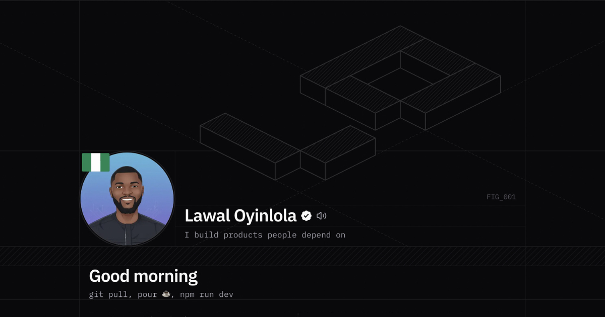

<br />

<div align="center">
  <a href="https://lawaloyinlola.com">
    
  </a>

  <h1 align="center">LAWAL | Professional Portfolio</h1>

  <p align="center">
    The digital home of Oyinlola Lawal — Frontend Engineer & UI Architect.
    <br />
    A showcase of high-performance interfaces, complex infrastructure solutions, and pixel-perfect design implementation.
    <br />
    <br />
    <a href="https://lawaloyinlola.com"><strong>Explore the live site »</strong></a>
    <br />
    <br />
    <a href="https://github.com/lawalOyinlola">GitHub Profile</a>
    ·
    <a href="https://www.linkedin.com/in/lawaloyinlola">LinkedIn</a>
    ·
    <a href="https://x.com/honeyzrich">X (Twitter)</a>
  </p>
  
  <!-- <p align="center">
    <strong>🏆 Proudly part of the <a href="https://devcareer.io">DevCareer</a> × <a href="https://raenest.com">Raenest</a> Freelancer Hackathon (March 2026)</strong>
  </p> -->
</div>

<div align="center">


</div>

---

## 📖 About The Project

This repository houses the source code for my personal portfolio website. As a Senior Frontend Engineer and UI Architect specializing in FinTech and AI-powered platforms, I built this site not just as a showcase of past work, but as a demonstration of my core engineering philosophy: bridging the gap between complex backend infrastructure and elegant, accessible user experiences.

The focus here is on **performance**, **clean architecture**, and **animation that serves usability** without sacrificing speed. It is also where I write: the blog covers application security and engineering, and every post is syndicated to dev.to from this repo.

### Key Features

- **Next.js 16 App Router:** React Server Components and static generation for fast first loads and good SEO.
- **Blog from Markdown:** posts live in `content/blog/` as plain Markdown, validated at build time, with syntax highlighting, a table of contents, image zoom, tag filters and an RSS feed.
- **dev.to syndication:** `pnpm sync:devto` pushes posts to dev.to with the canonical URL pointing back here. See [docs/blogging.md](docs/blogging.md).
- **Magnetic micro-interactions:** a custom `Magnetic` component built on GSAP for a physically reactive UI.
- **Cursor orchestration:** a `TargetCursor` that morphs and reacts to interactive zones in real time.
- **GSAP animation:** staggered, scroll-driven sequences engineered for 60fps, with reduced-motion respected.
- **SEO and AI discovery:** Metadata API, JSON-LD structured data, a sitemap, and `/llms.txt` for AI crawlers.
- **Security by default:** a Content Security Policy and security headers on every response, plus CI that fails on high-severity dependency advisories or a committed secret.
- **Accessible, responsive design:** built with WCAG guidelines in mind, fluid from large desktops to mobile with **Tailwind CSS**.

---

## 🛠️ Tech Stack

| Category            | Technology                                                                            | Description                                                          |
| :------------------ | :------------------------------------------------------------------------------------ | :------------------------------------------------------------------- |
| **Framework**       |  Next.js 16     | App Router, Server Components, static generation.                    |
| **Language**        |  TypeScript    | Strict typing for robust, maintainable code.                         |
| **Styling**         |  Tailwind CSS | Tailwind v4, utility-first and responsive.                           |
| **Animation**       |  GSAP           | Complex animation sequences and scroll triggers.                     |
| **Content**         | 📝 unified, remark, rehype, Shiki                                                     | Markdown to HTML with highlighted code; frontmatter validated by zod. |
| **Fonts**           | 🔤 Local Fonts                                                                        | `next/font/local`, optimized for zero layout shift.                  |
| **Package manager** |  pnpm                | Pinned in `package.json` through `packageManager`.                   |
| **Deployment**      |  Vercel            | Edge network deployment, preview deploys per branch.                 |

---

## 🚀 Getting Started

### Prerequisites

- Node.js **20.9 or newer** (Next.js 16's minimum; CI runs Node 22)
- pnpm, which Corepack can provide: `corepack enable`

### Installation

1.  **Clone the repository**

    ```bash
    git clone https://github.com/lawalOyinlola/lawalPortfolio.git
    cd lawalPortfolio
    ```

2.  **Install dependencies**

    ```bash
    pnpm install
    ```

    Use pnpm rather than npm or yarn: the lockfile is `pnpm-lock.yaml`, and the dependency overrides in `package.json` only apply under pnpm.

3.  **Run the development server**

    ```bash
    pnpm dev
    ```

4.  **View the site**
    Open [http://localhost:3000](http://localhost:3000) in your browser.

### Scripts

| Command           | What it does                                                      |
| :---------------- | :---------------------------------------------------------------- |
| `pnpm dev`        | Development server. Draft posts are visible here.                 |
| `pnpm build`      | Production build. Fails on invalid post frontmatter.              |
| `pnpm start`      | Serves the production build.                                      |
| `pnpm lint`       | ESLint.                                                           |
| `pnpm sync:devto` | Pushes blog posts to dev.to. Needs `DEVTO_API_KEY` in `.env.local` (see `.env.example`). |

---

## 📂 Project Structure

```text
content/
├── blog/                 # Blog posts, one Markdown file per post; filename = URL slug
└── linkedin/             # LinkedIn copy and carousels that accompany a post (not rendered)
docs/
└── blogging.md           # How to write, publish and syndicate a post
public/
└── images/blog/<slug>/   # Images for each post
scripts/
└── sync-devto.mjs        # Syndicates posts to dev.to
src/
├── app/
│   ├── (route)/          # Pages: home, about, faq, projects, blog (+ RSS feed)
│   ├── constants/        # Centralized data: brand, projects, FAQs, partners, stats
│   ├── fonts/            # Local font files
│   ├── layout.tsx        # Root layout with metadata and JSON-LD
│   ├── llms*.txt/        # /llms.txt and /llms-full.txt for AI crawlers
│   ├── robots.ts
│   └── sitemap.ts
├── components/
│   ├── content/          # Blog UI: post cards, prose, table of contents, image zoom
│   ├── ui/               # Primitives (buttons, carousel, Magnetic, tooltips)
│   └── *.tsx             # Page sections (Hero, Navbar, Footer, Projects, ...)
├── hooks/                # useScrollLock, useWindowDimensions, usePrefersReducedMotion
└── lib/
    ├── content.ts        # Loads and validates posts from content/
    └── markdown.ts       # The Markdown rendering pipeline
```

---

## ✍️ Writing a Post

Everything is in [docs/blogging.md](docs/blogging.md). The short version: add `content/blog/<slug>.md`, push, wait for the deploy, then run `pnpm sync:devto`. The post lands on dev.to as a draft until you set `devto_published: true`.

---

## 🔒 Security

- Security headers, including a Content Security Policy, are set in `next.config.ts`.
- [`.github/workflows/security.yml`](.github/workflows/security.yml) runs `pnpm audit` and a gitleaks secret scan on every pull request and push to `main`.
- Dependabot raises security updates automatically.

---

## 📮 Contact

Oyinlola Lawal - [@honeyzrich](https://x.com/honeyzrich) - oyinlolalawal1705@gmail.com

Project Link: [https://github.com/lawalOyinlola/lawalPortfolio](https://github.com/lawalOyinlola/lawalPortfolio)

---

<div align="center">
  <p>Built with precision and passion by <a href="https://lawaloyinlola.com">LAWAL</a>.</p>
</div>
